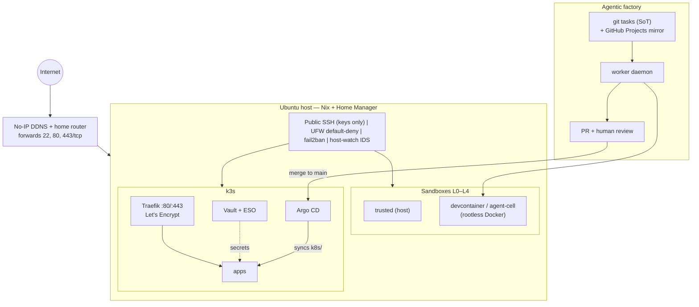

# homelab-forge

[](https://github.com/diestrin/homelab-forge/actions/workflows/ci.yml)
[](https://github.com/diestrin/homelab-forge/actions/workflows/gitleaks.yml)
[](./LICENSE)

Declarative, agent-operated home lab platform for a single powerful workstation/server
(Intel NUC class): remote development, sandboxed project execution, local Kubernetes,
and an agentic software factory.

> **Status:** Phases 0–5 complete. Follow [`PLAN.md`](./PLAN.md) and [`docs/phases/`](./docs/phases/).
> Changes ship via [`CHANGELOG.md`](./CHANGELOG.md) and tagged releases.
>
> **Public from day one** — never commit secrets. Vault is the system of record;
> see [`docs/runbooks/vault.md`](./docs/runbooks/vault.md).

## Goals

- Treat the host as infrastructure-as-code (Nix on Ubuntu), reproducible and portfolio-grade.
- Support Cursor over hardened public SSH without compromising isolation between projects.
- Run k3s with Traefik on 80/443, Let’s Encrypt, and home router port-forward (No-IP).
- Enable an agentic workflow: chat → git tasks (+ GitHub Projects) → sandboxed workers → review.
- Store secrets in Vault; continuously deliver with Argo CD from `main`.
- **Import** `host-watch` in-tree; mine `local-brain` lessons instead of reinventing them.

## Architecture



Factory details: [`factory/README.md`](./factory/README.md) · board:
[homelab-forge factory](https://github.com/users/diestrin/projects/1) ·
demo recording: [`docs/demo/factory-demo.cast`](./docs/demo/factory-demo.cast)
(play with `asciinema play docs/demo/factory-demo.cast`).

## Quick start (this host)

```bash
./bootstrap                 # Home Manager
./bootstrap --system        # + system-manager sysctl/journald (sudo TTY)

./forge sandbox init
./forge sandbox enter sandbox/examples/hello-flake --profile trusted
./forge sandbox smoke

./forge factory validate
./forge factory sync
./forge factory demo        # guided task → worker PR → Argo path
```

Details: [`nix/README.md`](./nix/README.md), [`sandbox/README.md`](./sandbox/README.md),
[`docs/runbooks/factory.md`](./docs/runbooks/factory.md).

Bootstrapping a clean machine (no WAN ingress needed):
[`docs/runbooks/bootstrap-clean-host.md`](./docs/runbooks/bootstrap-clean-host.md).
Day-2 operations (reboot, Vault unseal, cert checks):
[`docs/runbooks/operations.md`](./docs/runbooks/operations.md).

## Threat model

The host is a single-user forge: hardened public SSH, UFW default-deny, and host-watch IDS.
Projects share one kernel, so isolation is **layered**, not absolute hypervisor multi-tenant security.

**Sandboxes:** `trusted` (L0) is the operator’s full host session. `devcontainer` (L1) and
`agent-cell` (L4) run in rootless Docker with **project-only bind mounts**, resource caps,
**no Docker socket**, and localhost-only publish — so a compromised cell should not reach
sibling project trees or the host dockerd control plane. Writable agent-cells run as root
*inside* the container (rootless uid remap); isolation is the mount set, not the container uid.
`incus` (L2) raises the boundary to a system container when installed. `k8s-workload` (L3)
uses NetworkPolicies in `forge-agents`.

**Factory:** Orchestrator writes git tasks only. Workers claim one task, use Vault AppRole
short-lived tokens, and stop at `review`. Merge to `main` is a human gate; Argo CD is the only
steady-state deploy path. The opt-in worker daemon can push branches if credentials exist —
keep the `proposed` queue intentional. Residual risk: container escape / kernel bugs, and
anything the operator runs under `trusted`. Secrets stay off the git tree and off shared mounts.

## What this is not

- **Not a multi-tenant cloud.** One operator, one host, one kernel. Sandboxes reduce blast
  radius between projects; they are not a security boundary you should sell to strangers.
- **Not highly available.** Single node, single disk pool, Shamir 1-of-1 Vault unseal.
  A reboot means a manual unseal ([`docs/runbooks/operations.md`](./docs/runbooks/operations.md)).
- **Not autonomous production deploys.** Agents stop at PR `review`; a human merges to
  `main`, and only Argo CD deploys what `main` already contains.
- **Not a NixOS distribution.** Ubuntu 24.04 with Nix + Home Manager on top (ADR-001).
- **Not a turnkey product.** It is a documented reference: adapt hostnames, disks, and
  DDNS to your own environment.

## Repository layout

```text
homelab-forge/
  PLAN.md                 # Master plan + agent handoff
  README.md               # This file
  CHANGELOG.md            # Release history (Keep a Changelog)
  LICENSE                 # MIT
  bootstrap               # Idempotent HM (+ optional system-manager) apply
  forge                   # Sandbox + factory CLI
  Makefile                # sandbox-* / factory-* convenience targets
  .github/workflows/      # CI: flake check, lint, kubeconform, schema, gitleaks
  docs/
    current-state.md      # Snapshot of the host
    decisions/            # Architecture Decision Records (ADRs)
    phases/               # Ordered implementation phases
    runbooks/             # operations, network, restore, secrets, sandbox, factory
    demo/                 # asciinema recording of the factory flow
  nix/                    # flakes, home-manager, system-manager modules
  sandbox/
    images/               # L1/L4 Dockerfile (Nix + direnv)
    profiles/             # trusted, devcontainer, incus, k8s-workload, agent-cell
    templates/            # flake+direnv project template
    examples/             # hello-flake sample
    scripts/              # smoke tests, layout, optional Incus install
  k8s/                    # cluster manifests; Argo CD syncs from main
  factory/                # task schema, tasks, worker daemon, playbooks
  security/
    host-watch/           # imported host IDS (from ../host-watch)
    scripts/              # install-host-watch + Phase 0 harden/apply helpers
```

## Locked decisions (summary)

See [`PLAN.md`](./PLAN.md) “Accepted answers” and ADRs 001–008: direct LE + port-forward,
public SSH, Ubuntu+Nix, git+GitHub Projects, public repo, `localpower.diegobarahona.com`,
Vault, in-tree host-watch, Argo CD.

## Future work

- **NixOS** stays deferred (ADR-001): the Ubuntu + Nix split works and a reinstall buys
  little until the host needs re-provisioning. If that day comes, `nix/` is the seed.
- Ethernet uplink instead of Wi-Fi for reliability; multi-arch sandbox images; Vault
  auto-unseal via a hardware token.

## Related existing projects

| Path | Role relative to this repo |
| --- | --- |
| [`../host-watch`](../host-watch) | Host IDS — **imported** into `security/host-watch/`; sibling deprecated. |
| [`../local-brain`](../local-brain) | Earlier security/performance notes for this NUC. **Mined for requirements**, superseded. |
| [`../dev-machine`](../dev-machine) | Prototype Nix+direnv Docker image — ideas reused in `sandbox/images/Dockerfile`. |

## For follow-up agents

1. Read [`PLAN.md`](./PLAN.md) end-to-end.
2. Read [`docs/current-state.md`](./docs/current-state.md).
3. Execute **one phase at a time** from [`docs/phases/`](./docs/phases/), updating checkboxes and ADRs as decisions solidify.
4. Do **not** install cluster/ingress or expose ports 80/443 until Phase 0 security gates pass.

## License

[MIT](./LICENSE). The imported [`security/host-watch/`](./security/host-watch/) retains its
original MIT notice.
