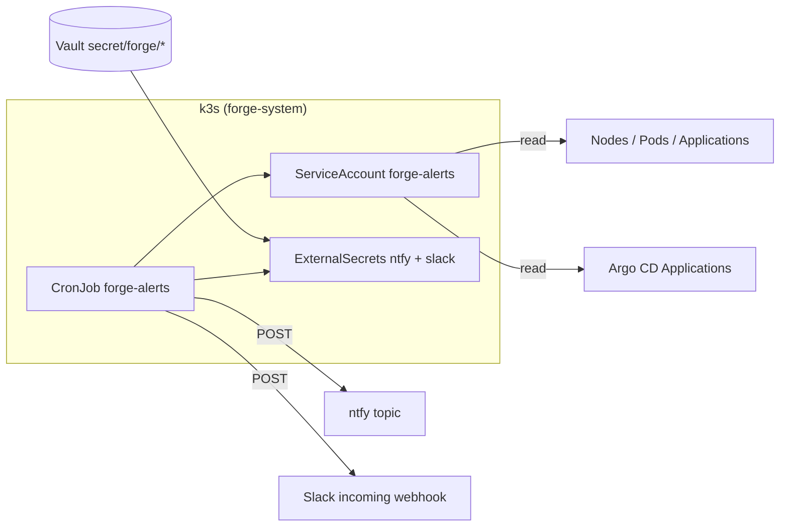

# TASK-012 plan — forge monitoring and alerting (ntfy + Slack)

## What

Extend the homelab-forge platform with **actionable alerts** when steady-state
deployments are unhealthy or the single-node k3s host is under resource pressure.
Alerts go to **ntfy** (mobile push) and a dedicated **Slack channel** (operator
desktop), using secrets from Vault only.

Today the cluster has a minimal CronJob (`k8s/platform/metrics/alerts.yaml`) that
checks node Ready status and Vault pod phase, and posts to ntfy only. Host security
scanning lives in `security/host-watch/` (ADR-005) and is out of scope here.

This task delivers a small, testable **`forge-alerts`** checker run as a Kubernetes
CronJob in `forge-system`, synced by Argo CD with the rest of `k8s/platform/metrics/`.

## Why

The operator needs to know **before** a demo site goes dark or the NUC runs out of
disk/memory — not only after manually opening Argo CD or SSH-ing in. Factory task
Slack notifications (TASK-011) cover **agent/CI lifecycle** on a task thread; they
do not cover platform health (Argo apps, CrashLoop pods, node pressure).

| Gap today | After TASK-012 |
| --- | --- |
| ntfy only; no Slack for platform ops | Both channels; operator chooses where to look |
| Nodes-not-Ready + Vault pod only | Argo Application health/sync, failing workloads, resource pressure |
| Inline shell; hard to test or dedupe | Python checker with unit tests and alert deduplication |

## Architecture

### Alert routing

| Severity | ntfy | Slack | Examples |
| --- | --- | --- | --- |
| critical | yes (priority `urgent`) | yes | Node NotReady; Argo app `Degraded` >15m; MemoryPressure |
| warning | yes (priority `high`) | yes | Pod CrashLoopBackOff; sync `OutOfSync` >30m; memory >85% |
| info | yes only | no | Transient blip recovered (optional “resolved” ping) |

Slack uses an **Incoming Webhook** to a dedicated ops channel (e.g. `#forge-alerts`),
**not** the factory task thread API from TASK-011. That keeps platform paging separate
from “CI green on PR #42”.

## How (implementation steps)

1. **Plan gate:** task stays `planning` until operator approves and
   `./forge factory approve TASK-012` moves status to `proposed`.
2. **Python service** — add `apps/forge-alerts/`:
   - Package layout mirroring `apps/family-agile-sync/` (pyproject.toml, `src/forge_alerts/`).
   - Single CLI entrypoint: `forge-alerts check` (exit 0 = healthy, 1 = alerts fired).
   - Modules:
     - `checks/argocd.py` — list `Application` CRs in `forge-system`; flag
       `status.health.status != Healthy` or `status.sync.status == OutOfSync` when
       `metadata.name` is in allowlist: `forge-site`, `family-agile-sync`, `root`
       (configurable).
     - `checks/workloads.py` — pods in namespaces `forge-demo`, `forge-system`,
       `family-agile`, `forge-agents` with `CrashLoopBackOff`, `ImagePullBackOff`,
       or `Ready=False` for >10m (owner kind Deployment/StatefulSet/CronJob).
     - `checks/node.py` — node conditions (`MemoryPressure`, `DiskPressure`,
       `PIDPressure`, `Ready`); optional `kubectl top node` when metrics-server
       reports memory >85% or CPU >90% sustained (two consecutive runs).
     - `checks/vault.py` — retain existing Vault pod Running check (port from current shell).
     - `notify.py` — `notify_ntfy()` (Title, Priority, Tags headers) and
       `notify_slack()` (webhook JSON `{ "text": "..." }`); no-op when URL unset.
     - `state.py` — JSON state file (alert fingerprint → last_sent_ts) to suppress
       repeat notifications within a cooldown (default 60m per fingerprint; 15m for critical).
   - Config via env vars (CronJob `env` + Secret refs); no secrets in code or git.
   - `DRY_RUN=1` logs would-be alerts without sending (for operator smoke tests).
3. **Container image** — `apps/forge-alerts/Dockerfile` based on `python:3.12-slim`,
   installs `kubectl` binary (pinned version matching `k8s/bootstrap/VERSIONS.md`) for
   `top` and CR queries. Publish via new workflow
   `.github/workflows/forge-alerts-image.yml` (pytest gate, push to GHCR on `main`
   only, same pattern as other app images).
4. **Kubernetes manifests** — evolve `k8s/platform/metrics/` (Argo-managed):
   - Replace inline shell in `alerts.yaml` with CronJob `forge-alerts` running the
     image above (schedule `*/5 * * * *`, `concurrencyPolicy: Forbid`).
   - Expand `ClusterRole forge-alerts` rules:
     - `argoproj.io/applications` — get, list, watch
     - `metrics.k8s.io/nodes` — get, list (for `kubectl top`)
     - existing `nodes`, `pods` get/list
   - **ExternalSecret `forge-alerts-slack`** — Vault path `secret/forge/alerts/slack`,
     key `webhook_url` → Secret `forge-alerts-slack`. Keep existing `externalsecret-ntfy.yaml`.
   - Wire env: `NTFY_URL` from Secret `ntfy`; `SLACK_WEBHOOK_URL` from
     `forge-alerts-slack` (optional — checker skips Slack when empty).
   - Resource requests: 25m CPU / 64Mi memory (limits 200m / 128Mi).
5. **Vault / operator bootstrap** (documented, human-only):
   - Existing: `secret/forge/ntfy` with `url` (private topic).
   - New: `vault kv put secret/forge/alerts/slack webhook_url='https://hooks.slack.com/services/...'`
     (Incoming Webhook for `#forge-alerts`; create in Slack app settings — not the bot
     token used for factory threads).
   - Runbook section in `apps/forge-alerts/README.md`: how to test with `DRY_RUN=1`,
     how to silence a fingerprint, expected alert examples.
6. **CI:** `pytest` for pure check logic (mock K8s JSON fixtures); `ci.yml` or dedicated
   workflow runs lint + tests; gitleaks green; `kubectl kustomize k8s/platform/metrics`
   passes kubeconform.
7. **PR:** worker opens/updates implementation PR on branch
   `factory/task-012-a-monitoring-and-alerting-system-for-the`; complete
   [`factory/review/CHECKLIST.md`](../review/CHECKLIST.md).
8. **Deploy:** **human merge to `main` only.** Argo CD root overlay syncs
   `k8s/platform/metrics/` (ADR-008). Worker must not `kubectl apply` Argo-managed apps.

## Alert conditions (v1)

| ID | Check | Fire when | Cooldown |
| --- | --- | --- | --- |
| A1 | Node Ready | Any node `Ready=False` | 15m |
| A2 | Node pressure | Condition `MemoryPressure`, `DiskPressure`, or `PIDPressure` = True | 30m |
| A3 | Node utilization | metrics-server: memory >85% or CPU >90% of allocatable, 2 consecutive runs | 60m |
| A4 | Argo CD app | Named Application `health.status` ∈ {`Degraded`,`Missing`,`Unknown`} for >15m | 30m |
| A5 | Argo CD sync | Named Application `sync.status` = `OutOfSync` for >30m | 60m |
| A6 | Workload pod | Pod in target namespaces with `CrashLoopBackOff` or `ImagePullBackOff` | 30m |
| A7 | Workload ready | Deployment desired ≠ ready replicas for >15m (exclude Job pods) | 30m |
| A8 | Vault | Vault pod in `forge-system` not `Running` when present | 15m |

**Resolved notifications (optional v1):** when a fingerprint clears, send one ntfy
info message (“recovered: …”); skip Slack for recovery to reduce noise.

## Files touched (expected diff)

| Path | Change |
| --- | --- |
| `apps/forge-alerts/` | **New** — Python checker, Dockerfile, README, tests |
| `.github/workflows/forge-alerts-image.yml` | **New** — build/push image |
| `k8s/platform/metrics/alerts.yaml` | **Replace** shell CronJob with image-based `forge-alerts` |
| `k8s/platform/metrics/externalsecret-slack.yaml` | **New** — Slack webhook from Vault |
| `k8s/platform/metrics/kustomization.yaml` | Add externalsecret resource |
| `docs/runbooks/operations.md` | Short “Platform alerts” section + Vault paths |

**Not modified:** `security/host-watch/**`, UFW scripts, factory orchestrator/worker,
Argo Application definitions, `k8s/apps/*` workloads.

## Acceptance criteria

- `pytest` green for `apps/forge-alerts` (check parsers + dedupe logic with fixtures)
- `kubectl kustomize k8s/platform/metrics` renders and passes kubeconform
- CronJob RBAC least-privilege: read-only on listed resources; no create/patch/delete
- No credentials, webhook URLs, ntfy topics, or Slack user IDs in git; gitleaks green
- With Vault secrets populated, a deliberate test condition (e.g. scale
  `forge-site` Deployment to 0 in a **non-prod smoke namespace** or `DRY_RUN=0` against
  injected bad fixture in CI) produces ntfy + Slack messages documented in README
- Operator runbook documents Vault paths and Slack webhook setup
- After merge: Argo syncs metrics overlay; `kubectl -n forge-system get cronjob forge-alerts`
  shows Active; manual `kubectl create job --from=cronjob/forge-alerts` succeeds once

## Test plan (operator, post-merge)

1. Confirm ExternalSecrets `ntfy` and `forge-alerts-slack` show `SecretSynced`.
2. Run one-off job from CronJob; logs show “ok” with no false positives on healthy cluster.
3. Trigger A6 safely: create a throwaway `CrashLoopBackOff` pod in `forge-agents`
   (test manifest **not** committed); verify ntfy + Slack within one schedule interval;
   delete test pod; verify recovery info on ntfy if implemented.
4. Confirm factory task Slack threads are **unchanged** (TASK-011 path still task-scoped).

## Risks

- **Medium** — expanded RBAC reads cluster-wide Application CRs; mis-scoped rules could
  over-privilege the CronJob SA. Mitigation: explicit resourceNames or label selectors
  where possible; review in PR.
- **Noise** — flaky sync during Argo self-heal may page unnecessarily. Mitigation:
  time thresholds + fingerprint cooldown in `state.py`; tune in README.
- **Single-node blind spots** — host root disk full outside kubelet’s view may not
  surface as `DiskPressure` immediately. Mitigation: document that host-watch remains
  the IDS path; optional follow-up task for node-exporter if gaps persist.
- **Secret bootstrap** — Slack webhook is human-created; until Vault path is set,
  Slack leg is skipped silently (ntfy still works).

## Out of scope

- Prometheus, Grafana, Loki, or Alertmanager stack
- Modifying `security/host-watch` thresholds, systemd units, or notify code (ADR-005)
- UFW, SSH, Vault unseal automation, or host-watch install scripts
- Factory control-plane / TASK-011 task-thread Slack routing
- Preview namespace alerts (`forge-preview-*`) — follow-on once TASK-010 is live
- Worker `kubectl apply` to Argo-managed Applications
- PagerDuty, email, or SMS providers
- Committing secrets, tokens, or real Slack user IDs

## Relation to other tasks

| Task | Overlap | Boundary |
| --- | --- | --- |
| TASK-011 | Slack outbound | TASK-011 = factory agent/task threads via bot token; TASK-012 = platform ops webhook channel |
| TASK-010 | Deployment failures | TASK-010 previews are non-Argo; v1 alerts focus on Argo-managed steady-state apps |
| Phase 3.6 | ntfy alert | TASK-012 supersedes the minimal shell CronJob with dual-channel, richer checks |

## Slack iteration

Operator feedback (2026-09-01): plan lacked implementation detail — expanded above
with concrete checks, file list, Vault paths, and test plan. Further thread feedback
adjusts thresholds or namespace allowlists before approve → proposed.
