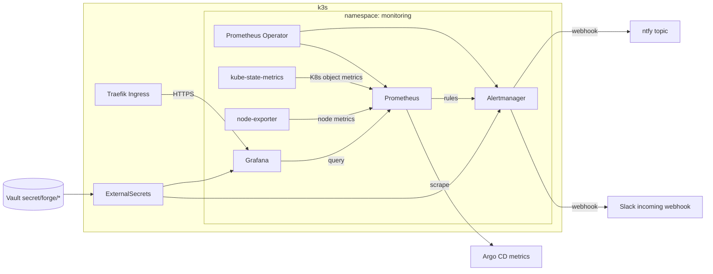

# TASK-012 plan — Prometheus + Grafana monitoring and alerting (ntfy + Slack)

## What

Replace the minimal shell CronJob in `k8s/platform/metrics/alerts.yaml` with a
**Prometheus + Grafana** observability stack suitable for a portfolio demo: live
dashboards the operator can show, and **declarative alerts** configured in git
(`PrometheusRule`) and tunable from Grafana.

Alerts still notify **ntfy** (mobile push) and a dedicated **Slack ops channel**
(desktop), using secrets from Vault only. Host security scanning stays in
`security/host-watch/` (ADR-005) and is out of scope.

## Why

The operator needs to know **before** a demo site goes dark or the NUC runs out of
disk/memory — and wants a **visible monitoring story** for the homelab-forge project,
not a hidden CronJob script.

| Gap today | After TASK-012 |
| --- | --- |
| Inline shell CronJob; ntfy only | Full metrics pipeline with Grafana dashboards |
| No dashboards or historical metrics | Cluster, node, and workload views for demos |
| Two checks (node Ready, Vault pod) | Prometheus rules for nodes, workloads, Argo apps, pressure |
| Alerts hard-coded in shell | PrometheusRule + Alertmanager routing (GitOps + Grafana UI) |

Factory task Slack (TASK-011) covers **agent/CI lifecycle** on a task thread; it does
not cover platform health. This task adds the ops paging layer on top of standard
observability tooling.

## Architecture

### Stack choice

Deploy **[kube-prometheus-stack](https://github.com/prometheus-community/helm-charts/tree/main/charts/kube-prometheus-stack)**
(pinned chart version in git) via a new **Argo CD Application** with Helm `values.yaml`
in-repo. This bundles Prometheus Operator, Prometheus, Alertmanager, Grafana,
kube-state-metrics, and node-exporter — the usual CNCF/portfolio stack.

A dedicated **`monitoring`** namespace keeps platform metrics separate from
`forge-system` control-plane pods.

### Alert routing

| Severity | ntfy | Slack | Examples |
| --- | --- | --- | --- |
| critical | yes (priority `urgent`) | yes | Node NotReady; Argo app degraded; MemoryPressure |
| warning | yes (priority `high`) | yes | Pod CrashLoopBackOff; sync OutOfSync; memory >85% |
| info | yes only | no | Optional recovery notification |

Slack uses an **Incoming Webhook** to a dedicated ops channel (e.g. `#forge-alerts`),
**not** the factory task thread API from TASK-011.

Alertmanager receiver config references webhook URLs from Kubernetes Secrets
(populated by ExternalSecrets). ntfy accepts plain POST; Alertmanager `webhook_configs`
or a minimal webhook adapter template handles Title/Priority headers.

### Grafana (portfolio)

- **Ingress:** `grafana.localpower.diegobarahona.com` (or subdomain documented in README)
  with cert-manager TLS — same Traefik pattern as `k8s/apps/forge-site/ingress.yaml`.
- **Auth:** admin password from Vault (`secret/forge/grafana`, key `admin_password`) via
  ExternalSecret; no default passwords in git.
- **Dashboards:** enable chart defaults (Kubernetes / Compute Resources / Node Exporter)
  plus one custom **Forge overview** dashboard (Argo app health, forge-demo workloads,
  Vault pod) exported as JSON under `k8s/platform/metrics/dashboards/` and provisioned
  via Grafana sidecar or ConfigMap — so dashboards are reviewable in PRs.
- **Alerting UX:** primary source of truth is `PrometheusRule` CRs in git; README
  documents how to explore firing alerts in Grafana → Alerting UI and adjust thresholds
  via PR (not ad-hoc prod edits without git).

## How (implementation steps)

1. **Plan gate:** task stays `planning` until operator approves and
   `./forge factory approve TASK-012` moves status to `proposed`.
2. **Namespace and network policy** — add `monitoring` to
   `k8s/platform/namespaces/namespaces.yaml`; add NetworkPolicies allowing:
   - Prometheus ↔ kube-state-metrics / node-exporter / API server scrape paths
   - Grafana ← Traefik ingress (from `kube-system`)
   - Alertmanager egress to HTTPS (Slack) and ntfy
   - DNS egress (same pattern as `k8s/platform/network-policies/default-deny.yaml`)
3. **Helm values** — add `k8s/platform/metrics/helm/kube-prometheus-stack-values.yaml`:
   - Pin chart version in Argo Application `spec.source.targetRevision`.
   - Size for single-node NUC: Prometheus retention ~7d, reasonable CPU/memory requests
     (document totals in README; target <2 GiB incremental RAM).
   - Enable `defaultRules` for kubernetes-apps, node, kube-state-metrics; disable
     components not needed (e.g. Grafana persistence optional — use PVC on local-path
     if dashboards/history matter for demos).
   - `grafana.ingress.enabled: false` in values — Ingress defined separately in kustomize
     for consistency with repo Traefik annotations.
   - ServiceMonitor for **Argo CD** metrics (`argocd-metrics` / `argocd-server-metrics`
     in `forge-system`) so Application health appears in Prometheus.
4. **Argo CD Application** — add `monitoring` Application to
   `k8s/overlays/root/applications.yaml`:
   - `source.chart: kube-prometheus-stack`
   - `source.repoURL: https://prometheus-community.github.io/helm-charts`
   - `source.helm.valueFiles` or inline values ref pointing at committed values file
     (use Argo `$values` ref or kustomize-generated ConfigMap pattern if needed).
   - Destination namespace: `monitoring`.
5. **PrometheusRules** — add `k8s/platform/metrics/rules/forge-alerts.yaml` with rules
   mapping plan conditions A1–A8 to PromQL (see table below). Labels:
   `severity: critical|warning`, `forge_alert_id: A1` etc. for Alertmanager routing.
6. **Alertmanager config** — extend Helm values or add
   `AlertmanagerConfig` CR (if operator-enabled) with receivers:
   - `ntfy` — webhook to `$NTFY_URL` from Secret
   - `slack-ops` — Slack webhook URL from Secret (skip silently when unset)
   - Route: `severity=critical` → both; `severity=warning` → both; `severity=info` → ntfy only
   - `repeat_interval` / `group_wait` implement cooldown (15m critical, 60m warning default)
7. **ExternalSecrets** — in `k8s/platform/metrics/`:
   - Keep / relocate `externalsecret-ntfy.yaml` (existing Vault path `forge/ntfy`).
   - Add `externalsecret-slack.yaml` — Vault `secret/forge/alerts/slack`, key
     `webhook_url`.
   - Add `externalsecret-grafana.yaml` — Vault `secret/forge/grafana`, key
     `admin_password`.
   - Wire secrets into Helm values via `existingSecret` refs (no literals in git).
8. **Grafana Ingress** — `k8s/platform/metrics/grafana-ingress.yaml` with
   cert-manager ClusterIssuer `letsencrypt-prod`, Traefik entrypoints `web,websecure`.
9. **Retire shell CronJob** — remove `forge-node-alert` CronJob, SA, and RBAC from
   `alerts.yaml` (or delete file once nothing references it). Update
   `k8s/platform/metrics/kustomization.yaml` to list new resources; root overlay already
   includes `../../platform/metrics`.
10. **Documentation** — `k8s/platform/metrics/README.md`:
    - Vault bootstrap commands (placeholder URLs only)
    - Grafana URL, login, dashboard tour for portfolio screenshots
    - How to run `amtool` / Grafana silences during maintenance
    - Safe smoke test: scale a throwaway Deployment in `forge-agents`, expect alert
11. **CI:** `helm template` or `kubeconform` on rendered manifests; gitleaks green;
    no new container image workflow (no custom app).
12. **PR:** worker opens/updates implementation PR on branch
    `factory/task-012-a-monitoring-and-alerting-system-for-the`; complete
    [`factory/review/CHECKLIST.md`](../review/CHECKLIST.md).
13. **Deploy:** **human merge to `main` only.** Argo CD syncs root overlay + monitoring
    Application (ADR-008). Worker must not `kubectl apply` Argo-managed apps.

## Alert conditions (v1 — PrometheusRule)

| ID | Check | PromQL / signal (indicative) | `for` | Cooldown |
| --- | --- | --- | --- | --- |
| A1 | Node Ready | `kube_node_status_condition{condition="Ready",status="true"} == 0` | 5m | 15m |
| A2 | Node pressure | Memory/Disk/PID pressure condition == True | 5m | 30m |
| A3 | Node utilization | node-exporter memory >85% or CPU >90% of instance | 10m | 60m |
| A4 | Argo CD app health | Argo metrics: app health ∈ {Degraded, Missing, Unknown} | 15m | 30m |
| A5 | Argo CD sync | `argocd_app_info{sync_status="OutOfSync"} == 1` for named apps | 30m | 60m |
| A6 | Workload pod | `kube_pod_container_status_waiting_reason{reason=~"CrashLoopBackOff\|ImagePullBackOff"}` in target NS | 10m | 30m |
| A7 | Deployment ready | desired ≠ ready replicas >15m for Deployments in target NS | 15m | 30m |
| A8 | Vault | Vault pod not Running in `forge-system` when present | 5m | 15m |

Target namespaces for A6/A7: `forge-demo`, `forge-system`, `family-agile`, `forge-agents`.
Named Argo apps for A4/A5: `forge-site`, `family-agile-sync`, `root`.

**Recovery (optional v1):** `alertmanager.config` `send_resolved: true` on ntfy receiver;
Slack receiver may omit resolved to reduce noise.

## Files touched (expected diff)

| Path | Change |
| --- | --- |
| `k8s/platform/namespaces/namespaces.yaml` | Add `monitoring` namespace |
| `k8s/platform/network-policies/` | Policies for `monitoring` namespace |
| `k8s/platform/metrics/helm/kube-prometheus-stack-values.yaml` | **New** — pinned Helm values |
| `k8s/platform/metrics/rules/forge-alerts.yaml` | **New** — PrometheusRule A1–A8 |
| `k8s/platform/metrics/dashboards/forge-overview.json` | **New** — provisioned dashboard |
| `k8s/platform/metrics/grafana-ingress.yaml` | **New** — HTTPS Grafana route |
| `k8s/platform/metrics/externalsecret-slack.yaml` | **New** — Slack webhook from Vault |
| `k8s/platform/metrics/externalsecret-grafana.yaml` | **New** — Grafana admin from Vault |
| `k8s/platform/metrics/alerts.yaml` | **Remove** shell CronJob / RBAC |
| `k8s/platform/metrics/kustomization.yaml` | Add rules, ingress, externalsecrets |
| `k8s/overlays/root/applications.yaml` | **New** `monitoring` Argo Helm Application |
| `k8s/platform/metrics/README.md` | **New** — operator + portfolio runbook |
| `docs/runbooks/operations.md` | Short “Observability” section + Vault paths |

**Not modified:** `security/host-watch/**`, UFW scripts, factory orchestrator/worker,
`apps/*` application code, TASK-011 Slack routing.

## Acceptance criteria

- Argo CD Application `monitoring` syncs Healthy; Prometheus, Grafana, Alertmanager pods Running
- Grafana loads over HTTPS; login uses Vault-sourced admin password
- At least three dashboards visible (two chart defaults + forge-overview)
- Deliberate test condition (throwaway CrashLoop pod in `forge-agents`, not committed)
  fires A6 and delivers ntfy + Slack within two evaluation intervals
- `PrometheusRule` objects present in cluster matching git; no credentials in repo
- Shell CronJob `forge-node-alert` absent after sync
- Operator README documents Vault paths, Grafana URL, and portfolio screenshot pointers
- After merge: `kubectl -n monitoring get prometheus,alertmanager,grafana` shows CRs/pods ready

## Test plan (operator, post-merge)

1. Confirm ExternalSecrets in `monitoring` (and `forge-system` for ntfy if shared) show
   `SecretSynced`.
2. Open Grafana Ingress URL; verify dashboards show node and pod metrics on healthy cluster.
3. Trigger A6 safely: create throwaway `CrashLoopBackOff` pod in `forge-agents`; verify
   alert in Grafana Alerting / Prometheus UI and ntfy + Slack within ~15m; delete pod.
4. Confirm factory task Slack threads are **unchanged** (TASK-011 path still task-scoped).
5. Capture one dashboard screenshot for portfolio README (optional, human).

## Risks

- **Medium** — kube-prometheus-stack adds several pods and CRDs on a single-node NUC;
  mis-sized requests may starve forge-site. Mitigation: conservative requests/limits in
  values; document RAM budget in README.
- **Medium** — new public Ingress surface (Grafana). Mitigation: strong admin password
  from Vault; no anonymous dashboards with sensitive data; consider OAuth follow-up.
- **Noise** — Argo self-heal sync blips may fire A5. Mitigation: `for:` durations and
  Alertmanager grouping; tune in PR review.
- **Argo metrics gap** — if ServiceMonitor misconfigured, A4/A5 silent. Mitigation:
  verify `argocd_app_info` series in Prometheus UI as part of test plan.
- **Secret bootstrap** — until Vault paths are set, Slack leg skipped; Grafana login fails
  until admin secret synced.

## Out of scope

- Custom Python/shell alert checker (`apps/forge-alerts`) — superseded by this plan
- Loki / Promtail log aggregation (follow-on if needed)
- Modifying `security/host-watch` thresholds, systemd units, or notify code (ADR-005)
- UFW, SSH, Vault unseal automation, or host-watch install scripts
- Factory control-plane / TASK-011 task-thread Slack routing
- Preview namespace alerts (`forge-preview-*`) — follow-on once TASK-010 is live
- Worker `kubectl apply` to Argo-managed Applications
- PagerDuty, email, or SMS providers
- Committing secrets, tokens, or real Slack user IDs

## Relation to other tasks

| Task | Overlap | Boundary |
| --- | --- | --- |
| TASK-011 | Slack outbound | TASK-011 = factory agent/task threads via bot token; TASK-012 = Alertmanager → ops webhook channel |
| TASK-010 | Deployment failures | TASK-010 previews are non-Argo; v1 alerts focus on Argo-managed steady-state apps |
| Phase 3.6 | ntfy alert | TASK-012 replaces minimal shell CronJob with Prometheus + Grafana stack |

## Iteration history

- **Slack (2026-09-01):** plan lacked detail — expanded with checks, Vault paths, test plan.
- **Portfolio (2026-09-01):** operator prefers Prometheus + Grafana (dashboards + alert
  configuration from the observability UI/stack) over bespoke Python CronJob — plan
  revised accordingly. Thresholds or subdomain names adjust in thread before approve → proposed.
